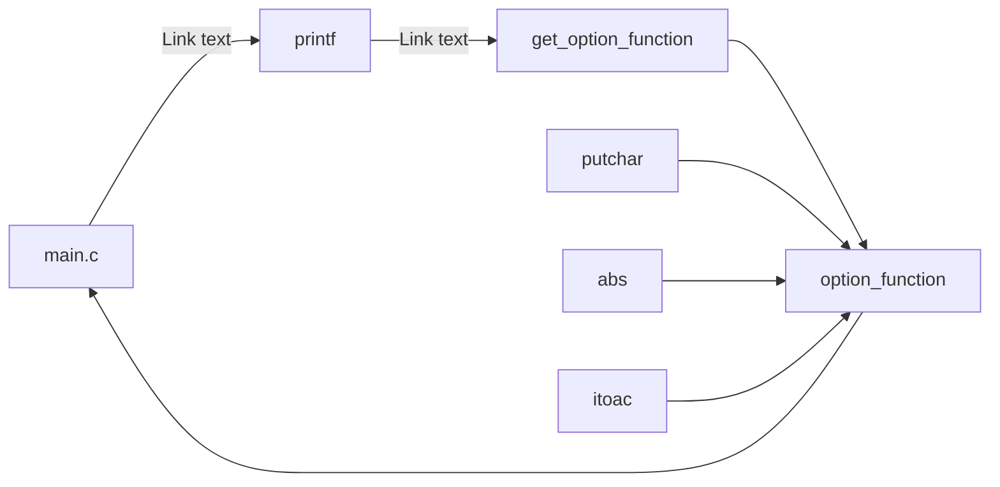

# printftest# printf

![#f03c15]# General Objective![#f03c15]
This project is designed to learn how a printf function works and to develop our own printf function.

![#f03c15]# Introduction![#f03c15]

A formatted output conversion C program completed as part of the low-level programming and algorithm track at Holberton School. The program is a pseudo- recreation of the C standard library function, printf.
The _printf function was coded on an Ubuntu 14.04 LTS machine with gcc version 9.4.0

![#f03c15]# Utilization![#f03c15]

To use the _printf function, assuming the aforementioned dependencies have been installed, compile all .c. Files in the repository and include the header main. H with any  main function.

Example main.c:

#include "main.h"

int main(void)
{
    _printf("Hello, World!");

    return (0);
}

# Compilation:

$ gcc *.c -o tester
Output:

$ ./tester
Hello, World!
$
# DESCRIPTION 
The function _printf writes output to standard output. The function writes under the control of a format string that specifies how subsequent arguments (accessed via the variable-length argument facilities of stdarg) are converted for output.

Prototype: int _printf(const char *format, ...);

Return Value
Upon successful return, _printf returns the number of characters printed (excluding the terminating null byte used to end output to strings). If an output error is encountered, the function returns -1.

Method

# Format of the Argument String

The format string argument is a constant character string composed of zero or more directives: ordinary characters (not %) which are copied unchanged to the output stream; and conversion specifications, each of which results in fetching zero or more subsequent arguments. Conversion specification is introduced by the character % and ends with a conversion specifier. In between the % character and conversion specifier, there may be (in order) zero or more flags, an optional minimum field width, an optional precision and an optional length modifier. The arguments must correspond with the conversion specifier, and are used in the order given.

d, i
Example main.c:

int main(void)
{
    _printf("%d\n", 9);
}
Output:

9
c
The int argument is converted to an unsigned char.

Example main.c:

int main(void)
{
    _printf("%c\n", 48);
}
Output:

0
s
The const char * argument is expected to be a pointer to a character array (aka. pointer to a string). Characters from the array are written starting from the first element of the array and ending at, but not including, the terminating null byte (\0).

Example main.c:

int main(void)
{
    _printf("%s\n", "Hello, World!");
}
Output:

Hello, World!
%
A % is written. No argument is converted. The complete conversion specification is %%.

Example:

int main(void)
{
    _printf("%%\n");
}
Output:

%
